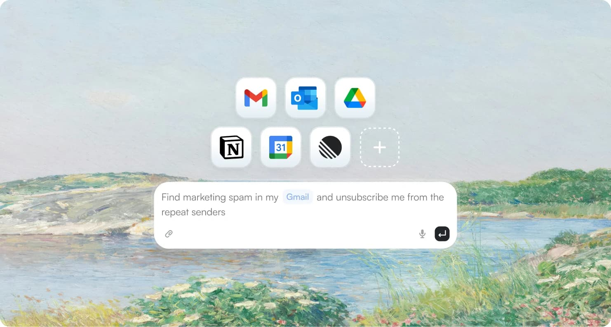
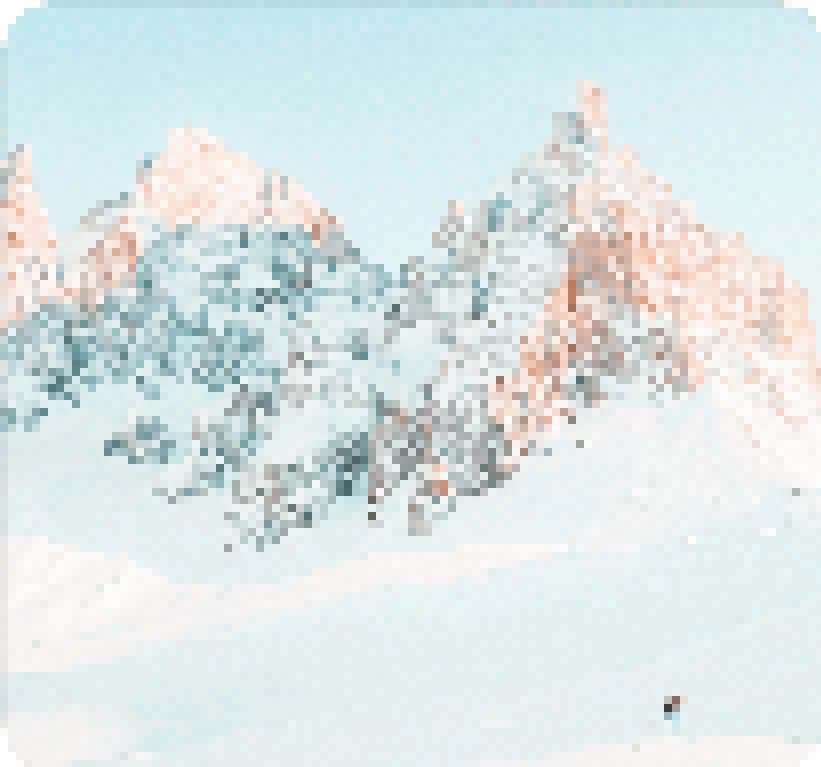

# zirui.space

zirui.space is a personal portfolio website built with Next.js. It presents product design work through case studies, design system practice, writing, visual explorations, and interactive prototypes.

## Live Site

https://zirui.space

## Screenshots

<table width="100%">
  <tr>
    <th width="33.33%">Drawing Register 2.0</th>
    <th width="33.33%">AXZO Design System</th>
    <th width="33.33%">Data Visualization</th>
  </tr>
  <tr>
    <td width="33.33%"></td>
    <td width="33.33%"></td>
    <td width="33.33%"></td>
  </tr>
</table>

## Featured Work

- Drawing Register 2.0
- AXZO Design System
- Data Visualization Screen Design

## Design Focus

Product design, design systems, enterprise workflows, data visualization, bilingual content structure, and interaction prototyping.

## Overview

- Portfolio homepage
- Work / Blog / About pages
- Design system preview
- Bilingual experience
- Theme-aware responsive design

## Tech Stack

- Next.js
- React
- TypeScript type checking
- ESLint
- pnpm

## Project Structure

```text
app/             Next.js app routes
design-system/   Local design system components and tokens
docs/            Design context and project documentation
scripts/         Development and validation scripts
src/             Site content, components, data, and preview modules
public/          Static assets for the portfolio experience
```

## Note

This repository is maintained as the source code for my personal portfolio. The best way to experience the work is through the live site.

- LinkedIn: [Zirui Zhao](https://www.linkedin.com/in/zirui-zhao-509306246/)
- Email: [Zhaozirui721@gmail.com](mailto:Zhaozirui721@gmail.com)
- X: [@atc12138](https://x.com/atc12138)
- Instagram: [@atc12138](https://www.instagram.com/atc12138/)
